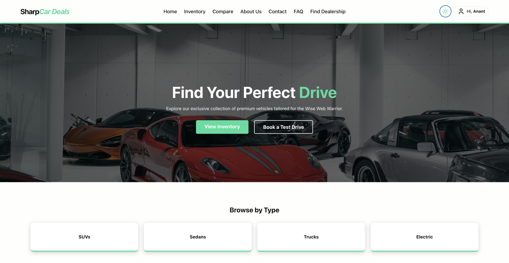

# 🚗 SharpCar Deals

> A full-stack car dealership platform for browsing inventory, comparing vehicles, finding dealerships, and managing listings — built for the modern web.



---

## 🌐 Live Demo

**[https://wise-web-warrior.vercel.app](https://wise-web-warrior.vercel.app)**

---

## 🔐 Admin Access

To explore the admin dashboard and management features:

| Field    | Value                  |
|----------|------------------------|
| Email    | `admin@cardeals.com`   |
| Password | `Admin@123`            |

---

## ✨ Features

- 🔍 **Browse Inventory** — Filter cars by type: SUVs, Sedans, Trucks, Electric
- ⚖️ **Compare Vehicles** — Side-by-side comparison of multiple cars
- 📍 **Find Dealership** — Map-based dealership locator (Google Maps embed)
- 👤 **User Profiles** — Manage personal info, address, and phone
- 🛠️ **Admin Dashboard** — Full CRUD for inventory, users, and dealerships
- 🌙 **Dark / Light Mode** — Theme toggle in the navbar
- 🔐 **Authentication** — Login / Register with JWT-based auth
- 📅 **Test Drive Booking** — Book a test drive directly from the listing

---

## 🛠️ Tech Stack

### Frontend
| Technology | Purpose |
|---|---|
| React (Create React App) | UI framework |
| React Router DOM v6 | Client-side routing |
| Axios | HTTP requests to backend |
| CSS Modules / Custom CSS | Styling |
| Google Maps iframe embed | Dealership map view |

### Backend
| Technology | Purpose |
|---|---|
| Node.js + Express | REST API server |
| JWT | Authentication & authorization |
| CORS | Cross-origin request handling |
| dotenv | Environment variable management |

### Database
| Technology | Purpose |
|---|---|
| MySQL / PostgreSQL | Relational data storage |
| Sequelize (or raw SQL) | ORM / query layer |

### Deployment
| Service | Role |
|---|---|
| Vercel | Frontend hosting |
| Railway / Render | Backend hosting |
| PlanetScale / Supabase | Managed database |

---

## 📁 Project Structure

```
wise-web-warrior/
├── frontend/               # React app (deployed to Vercel)
│   ├── public/
│   ├── src/
│   │   ├── pages/
│   │   │   ├── static/     # Home, About, FAQ, Contact
│   │   │   └── dynamic/    # Inventory, Profile, Compare, Dealership
│   │   ├── components/     # Navbar, Footer, Cards, etc.
│   │   ├── api/            # Axios instance & API calls
│   │   └── App.js
│   └── package.json
│
├── backend/                # Express REST API
│   ├── routes/
│   ├── controllers/
│   ├── middleware/         # Auth, error handling
│   ├── models/
│   └── package.json
│
├── database/               # SQL schema / migrations
├── .gitignore
└── README.md
```

---

## 🚀 Getting Started (Local Development)

### Prerequisites
- Node.js v18+
- npm or yarn
- MySQL or PostgreSQL running locally

### 1. Clone the repo

```bash
git clone https://github.com/techo-anant/wise-web-warrior.git
cd wise-web-warrior
```

### 2. Set up the backend

```bash
cd backend
npm install
```

Create a `.env` file in `/backend`:

```env
PORT=5000
DB_HOST=localhost
DB_USER=root
DB_PASSWORD=yourpassword
DB_NAME=cardeals
JWT_SECRET=your_jwt_secret
```

```bash
npm start
```

### 3. Set up the frontend

```bash
cd frontend
npm install
```

Create a `.env.local` file in `/frontend`:

```env
REACT_APP_API_URL=http://localhost:5000
```

```bash
npm start
```

App runs at **http://localhost:3000**

---

## 🌍 Deployment

### Frontend → Vercel

1. Push `frontend/` to GitHub
2. Import project on [vercel.com](https://vercel.com)
3. Set **Root Directory** to `frontend`
4. Add environment variable:
   ```
   REACT_APP_API_URL = https://your-backend-url.com
   ```
5. Deploy ✅

### Backend → Railway / Render

1. Deploy the `backend/` folder
2. Add all `.env` variables in the platform dashboard
3. Copy the live URL and update `REACT_APP_API_URL` on Vercel

---

## 🔒 CORS Configuration

The backend allows requests from the following origins:

```js
origin: [
  'https://wise-web-warrior.vercel.app',
  'https://wise-web-warrior-git-main-techo-anants-projects.vercel.app',
  'https://wise-web-warrior-qxchxgsng-techo-anants-projects.vercel.app',
  'http://localhost:3000'
]
```

---

## 📸 Screenshots

### 🏠 Home Page


### 🚘 Inventory
Browse and filter the full vehicle catalog.

### ⚖️ Compare
Select multiple vehicles and compare specs side by side.

### 📍 Find Dealership
View dealership locations on an interactive map.

---

## 👨‍💻 Author

**Anant Kumar Singh** — [@techo-anant](https://github.com/techo-anant)

**Inderpreet Singh Saini** -[@Inderpreetsinghsaini](https://github.com/Inderpreetsinghsaini)

**Xinlong Yan** — [@ColeoYan](https://github.com/ColeoYan)

**Steven Hyde** — [@shyde6](https://github.com/shyde6)

---

## 📄 License

This project is for educational and demonstration purposes.